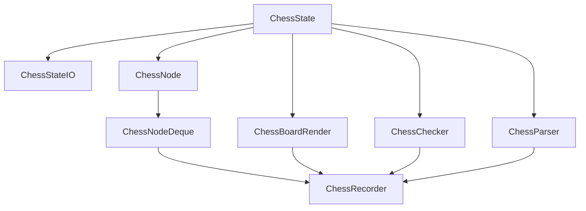

# chessnote

chessnote 是一个 Python 辅助库，用于在 **Jupyter Notebook** 中整理和分析中国象棋笔记。
它不是一个象棋游戏，而是方便学习者快速记录、可视化棋局和分析走法。

## 主要数据类型

- `ChessState`: 棋盘状态，主要是一个字典，键是坐标，值是大小写英文字母
- `ChessStateIO`：辅助类型，可以用于向字典和Json文件读取和写入棋盘状态
- `ChessBoardRender`: 棋盘渲染器，读取一个 `ChessState`（或一组 `ChessState`），输出图片（或GIF），可以加上位置高亮和箭头
- `ChessRecorder`：棋盘记录器，记录棋盘的连续变化过程。内部主要是一个由 `ChessNode` 组成的双向队列 `ChessNodeDeque`，`ChessNode` 记录一个 `ChessState` 以及附属信息
- `ChessParser`：辅助的静态类，主要负责解析中文棋谱信息，但是不负责合法性检查
- `ChessChecker`：辅助的静态类，负责检查指定状态下，棋子移动的（局部）合法性

## 项目结构



## 使用示例

- [demo](./demo/demo.ipynb)
- [象棋笔记——急进中兵](./demo/象棋笔记——急进中兵.ipynb)

## 内部实现

在记录棋盘状态时，棋子采用大小写英文符号表示，如下表

| 符号  | 棋子  | 备注     |
| ----- | ----- | -------- |
| K / k | 帅/将 | King     |
| A / a | 仕/士 | Advisor  |
| E / e | 相/象 | Elephant |
| H / h | 马/馬 | Horse    |
| R / r | 车/車 | Rook     |
| C / c | 炮/砲 | Cannon   |
| P / p | 兵/卒 | Pawn     |

棋盘坐标采用第一象限坐标表示

- 横向：0–8
- 纵向：0–9
- 左下角为原点
- 默认红方在下半区，黑方在上半区，支持切换

除了支持直接指定起止点的坐标对进行移动，还支持中式棋谱表示：

- 红方使用汉字数字，黑方使用阿拉伯数字
- 红方和黑方对应棋子的名称可混用，例如车/車
- 提供简单的局部合法性检查（如棋子的移动规则、棋子是否存在，位置是否合理），不涉及全局的分析（如送将、困毙、长将等）

对于一些少见的特殊情况：同一列存在四个或五个兵/卒，或者有两列，每一列都有至少两个兵/卒，目前无法采用合适的四字表示，需要直接指定移动棋子的起止点坐标对。


## 下载使用

要求 Python>=3.11

```shell
pip install git+https://github.com/fenglielie/chessnote.git
```

测试代码

```python
from chessnote import ChessRecorder

r = ChessRecorder().exec(
    """
炮二平五，马8进7
马二进三，车9平8
车一平二，卒7进1
车二进六，马2进3
兵七进一，
"""
)
r.draw()
```

## 本地安装与开发

Clone
```shell
git clone https://github.com/fenglielie/chessnote.git
```

create and activate virtual environment
```shell
cd chessnote
python -m venv .venv

# bash
source .venv/bin/activate
# or Pwsh
.\.venv\Scripts\Activate.ps1
```

install dependencies
```shell
pip install -r requirements.txt
```

install chessnote
```shell
pip install -e .
```

test
```shell
python -m unittest discover -s tests
```
